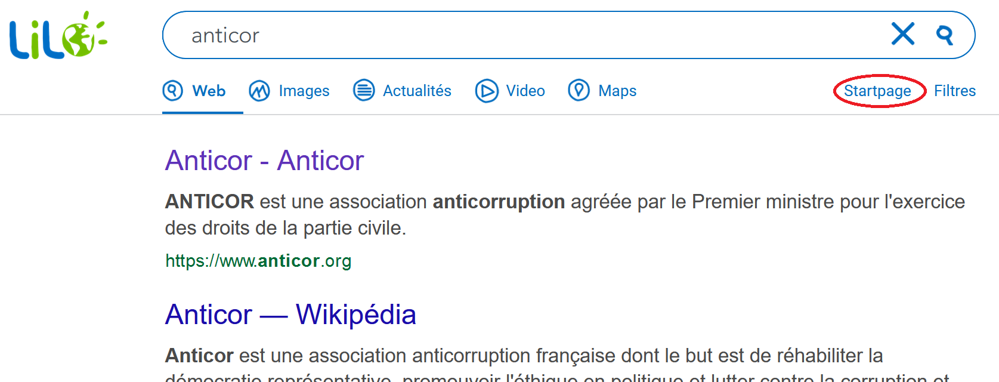

# Lilo+

***

If the results of Lilo do not suit you, there is a button "Google" allowing you to switch to a classic Google search. This extension replaces this button with a "Startpage" button. [Startpage](https://www.startpage.com/) is a search engine that respects your privacy, with results that are just as relevant to Google.

The Lilo search engine is available here: https://www.lilo.org/

This is not an official Lilo extension.

***

